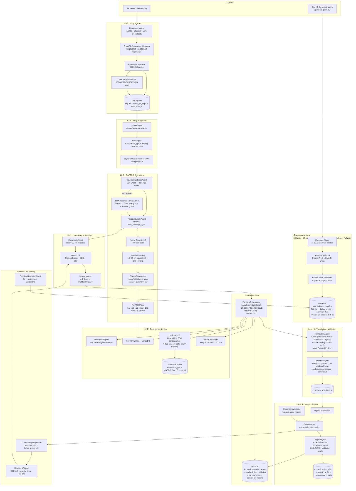
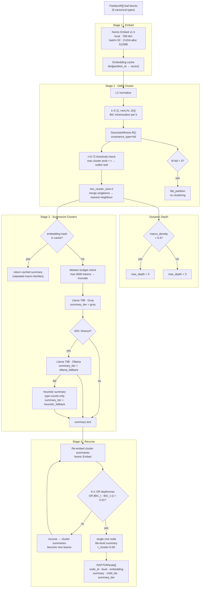
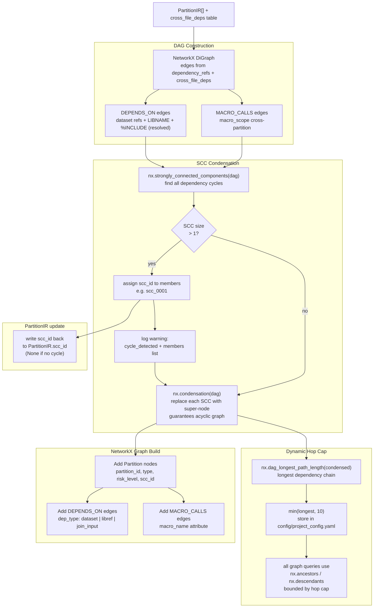
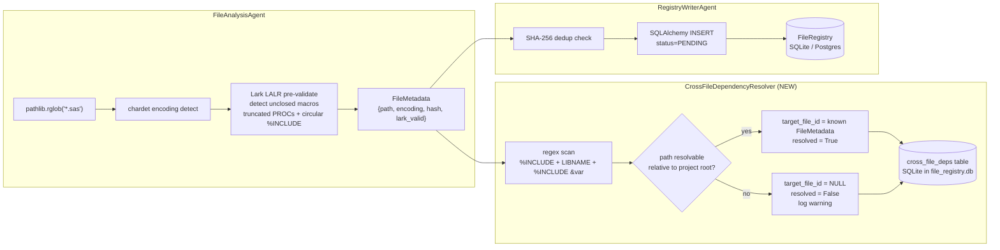
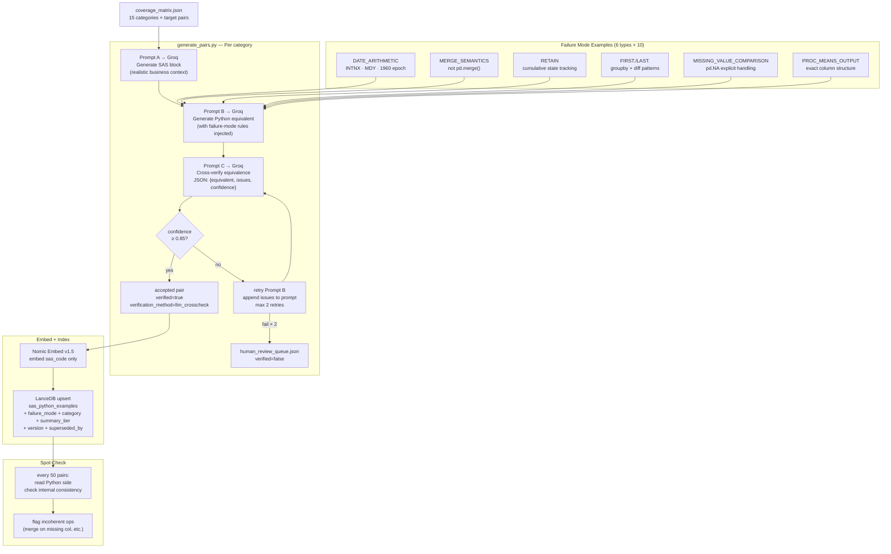
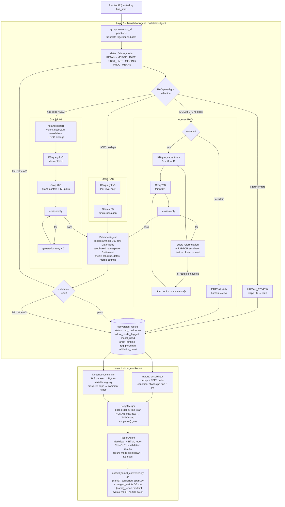
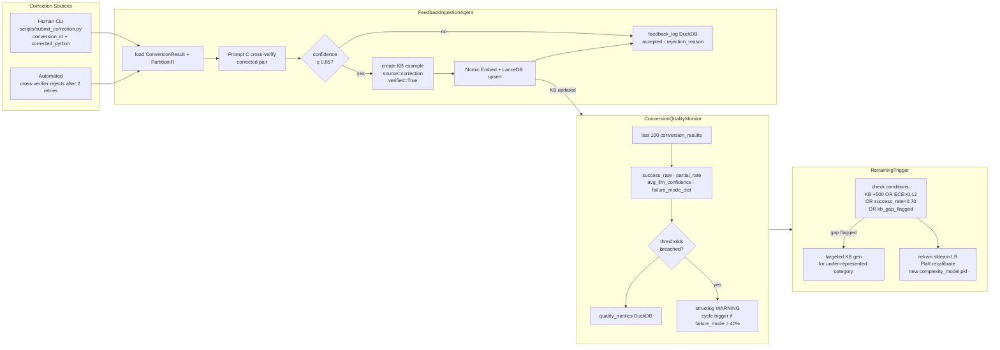

# SAS → Python / PySpark Partition Layer — System Architecture v2

> **Spec v4.1** · Based on **RAPTOR** (Sarthi et al., ICLR 2024) · 16-Agent Lean Pipeline · Calibrated Confidence · End-to-End Translation + Validation + Merge + Report + Continuous Learning

---

## Table of Contents

1. [Research Foundation — RAPTOR](#1-research-foundation--raptor-iclr-2024)
2. [Global Architecture — End-to-End Pipeline](#2-global-architecture--end-to-end-pipeline)
3. [RAPTOR Tree — Detailed Algorithm](#3-raptor-tree--detailed-algorithm)
4. [IndexAgent — SCC Condensation & Dynamic Hop Cap](#4-indexagent--scc-condensation--dynamic-hop-cap)
5. [9 Canonical Partition Types](#5-9-canonical-partition-types)
6. [Architecture Comparison — RAPTOR vs Flat Partitioning](#6-architecture-comparison--raptor-vs-flat-partitioning)
7. [Component-Level Architectures](#7-component-level-architectures)
   - [7.1 Entry Layer (L2-A)](#71-l2-a-entry-layer-with-crossfiledependencyresolver)
   - [7.2 Knowledge Base Build Pipeline](#72-knowledge-base-build-pipeline-dual-llm)
   - [7.3 Translation (L3) + Validation + Merge (L4) + Report](#73-layer-3-translation--validation--layer-4-merge--report)
   - [7.4 Continuous Learning Feedback Loop](#74-continuous-learning-feedback-loop)
8. [Complete Project File Tree](#8-complete-project-file-tree)
9. [Updated Timeline (14 Weeks)](#9-updated-timeline-14-weeks)

---

## 1. Research Foundation — RAPTOR (ICLR 2024)

| | |
|---|---|
| **Paper** | *RAPTOR: Recursive Abstractive Processing for Tree-Organized Retrieval* |
| **Venue** | ICLR 2024 — arXiv:2401.18059 |
| **Authors** | Sarthi, Abdullah, Goldie, Liskovich, Sherstinsky, Potts & Manning (Stanford NLP) |

### Original Contribution

RAPTOR builds **hierarchical tree summaries** of long documents using:
- **Gaussian Mixture Model (GMM)** clustering with BIC minimization for automatic k-selection.
- **Recursive LLM summarization** of clusters, producing summaries at multiple abstraction levels.
- Retrieval at **leaf** (fine-grained fact), **cluster** (thematic group), and **root** (document intent) levels.

### Our Adaptation to SAS Partitioning

Instead of treating every `DATA` step or `PROC` block as a flat, independent chunk, we cluster semantically related SAS blocks into a **recursive tree**. Downstream RAG layers retrieve at exactly the right level:

| Retrieval Level | RAG Type | Use Case |
|---|---|---|
| **Leaf** | Static RAG | Simple block lookup |
| **Cluster** | GraphRAG | Macro families and related blocks |
| **Root** | Agentic RAG | File-level planning and intent |

This directly addresses the core failure mode of flat partitioning — **losing context across `%INCLUDE` chains that span 50+ files**.

### Key Algorithmic Reuse from the Paper

- GMM clustering with **BIC minimization** for k-selection (§3.1).
- **Recursive re-embedding** of cluster summaries (§3.2).
- **Dynamic depth** based on content density (`macro_density > 0.4` triggers deeper trees).

### Target Metrics

| Metric | Target |
|---|---|
| Boundary accuracy | > 90% |
| RAPTOR hit-rate @5 | > 82% |
| ECE (calibration) | < 0.08 |
| Real agents (strict SRP) | 16 |
| Diff test coverage | 45% |
| Canonical partition types | 9 |

---

## 2. Global Architecture — End-to-End Pipeline

The system processes raw `.sas` files through a multi-layer pipeline: **scan → stream → chunk → score → persist → translate → merge**, with a continuous learning loop feeding back improvements.



### Pipeline Flow Description

The end-to-end flow works as follows:

1. **INPUT** — Raw `.sas` files and a coverage matrix enter the system.
2. **L2-A (Entry & Scan)** — `FileAnalysisAgent` discovers SAS files, detects encoding, and pre-validates syntax with a Lark LALR parser. `CrossFileDependencyResolver` scans for `%INCLUDE` and `LIBNAME` references to map cross-file relationships. `RegistryWriterAgent` deduplicates (SHA-256) and writes to a SQLite `FileRegistry`. `DataLineageExtractor` parses SET, MERGE, FROM, JOIN, DATA, CREATE TABLE, and INSERT INTO statements to build a table-level data lineage graph stored in the `data_lineage` table.
3. **L2-B (Streaming Core)** — `StreamAgent` reads files asynchronously in 8 KB chunks. `StateAgent` maintains a finite-state machine tracking block type, nesting depth, and macro stack. An `asyncio.Queue` with backpressure (max 200) regulates throughput.
4. **L2-C (RAPTOR Chunking)** — The core innovation. `BoundaryDetectorAgent` uses a Lark LALR grammar for **80% of cases** (rule-based). The remaining **20% ambiguous** boundaries are resolved by a local Llama 3.1 8B model via Ollama, with a tiktoken token guard. `PartitionBuilderAgent` creates partition objects of 9 canonical types. Partitions are then embedded (Nomic Embed v1.5, 768-dim), clustered (GMM with BIC), summarized (Llama 70B via Groq, with hash caching), and assembled into a **RAPTOR tree** (leaf → L1 → L2 → root). Recursion stops when BIC delta < 0.01.
5. **L2-D (Complexity & Strategy)** — `ComplexityAgent` extracts 5 features (including radon cyclomatic complexity). A calibrated `sklearn` Logistic Regression model (Platt scaling, ECE < 0.08) assigns risk levels. `StrategyAgent` decides the partition strategy per block.
6. **Knowledge Base** — 330 SAS→Python/PySpark example pairs across 15 categories, generated by a **dual-LLM chain** (Prompt A → B → C cross-verify). Includes 60 dedicated failure-mode examples (6 types × 10 each). Stored in LanceDB with 768-dim embeddings. Each entry carries a `version` integer and `superseded_by` pointer for KB versioning; changes are audited in the `kb_changelog` DuckDB table.
7. **L2-E (Persistence & Index)** — `PersistenceAgent` writes to SQLite/Postgres/Parquet. `RAPTORWriter` pushes tree nodes to LanceDB. `IndexAgent` builds a NetworkX dependency graph, performs **SCC condensation** (handling circular `%INCLUDE` chains), and stores the graph in-memory with `DEPENDS_ON` and `MACRO_CALLS` edge types. Redis checkpoints every 50 blocks (TTL 24h) for fault tolerance.
8. **Layer 3 (Translation + Validation)** — `TranslationAgent` selects one of **three RAG paradigms** per partition: **Static RAG** (LOW risk, no deps → fixed k=3, leaf level, Ollama 8B, no cross-verify), **GraphRAG** (cross-file deps or SCC → `nx.ancestors()` for upstream translations + SCC siblings, k=5, cluster level, Groq 70B, cross-verify, generation retry), or **Agentic RAG** (MOD/HIGH risk → adaptive k 5→8→11, query reformulation on failure, RAPTOR level escalation leaf→cluster→root, retrieval retry, final escalation combines root + graph context). All paradigms feed into `ValidationAgent`, which executes the generated code via `exec()` on a synthetic 100-row DataFrame in a sandboxed namespace (restricted builtins, 5 s timeout, no I/O). It checks: no exceptions, expected columns present, date-range plausibility, merge row-count bounds. On pass → L4; on fail with retries < 2 → re-translate; on fail with retries ≥ 2 → PARTIAL; structural_only blocks auto-pass.
9. **Layer 4 (Merge + Report)** — `ImportConsolidator` deduplicates imports. `DependencyInjector` maps SAS datasets to Python variables. `ScriptMerger` assembles final `.py` files with `ast.parse()` syntax validation. Untranslated blocks get `TODO` stubs. `ReportAgent` then generates a Markdown + HTML conversion report containing: header, summary table (SUCCESS/PARTIAL/FAILED/HUMAN_REVIEW counts), failure-mode breakdown, HUMAN_REVIEW block list, CodeBLEU scores, validation results, dependency-graph summary, and KB retrieval stats. Outputs `{name}_report.md` + `{name}_report.html`, persisted to the `conversion_reports` DuckDB table.
10. **Continuous Learning** — `FeedbackIngestionAgent` accepts corrections (automated + CLI). `ConversionQualityMonitor` tracks success rates and failure-mode distribution. `RetrainingTrigger` recalibrates the complexity model when ECE drifts or quality drops.
11. **Orchestration** — `PartitionOrchestrator` (LangGraph `StateGraph`) coordinates all layers with states including `CROSS_FILE_RESOLVE`, `TRANSLATING`, and `MERGING`. All LLM calls and quality metrics are audited in DuckDB.

---

## 3. RAPTOR Tree — Detailed Algorithm

> **Key difference from the paper:** Sarthi et al. apply RAPTOR to natural-language documents. We apply it to **SAS code blocks**. The GMM clustering and recursive summarization are unchanged — only the leaf content (SAS code instead of text paragraphs) and the convergence trigger (`macro_density > 0.4` → `depth=5`) are domain-specific additions.



### Stage-by-Stage Walkthrough

#### Stage 1 — Embed

- Every `PartitionIR` leaf block (one of the 9 canonical types) is embedded using **Nomic Embed v1.5** (768 dimensions, running locally).
- Embeddings are batched (batch size 32) with CUDA allocation capped at 512 MB.
- Results are cached in a `dict[partition_id → vector]` to avoid redundant computation.

#### Stage 2 — GMM Cluster

1. **L2-normalize** all embedding vectors.
2. **Select k** from the range `[2, min(√N, 20)]` by evaluating BIC (Bayesian Information Criterion) for each candidate k and choosing the minimum.
3. **Fit** `sklearn.mixture.GaussianMixture` with `covariance_type='full'`.
4. **Threshold check** (`τ = 0.72`): If a leaf's maximum cluster membership probability is below 0.72, it is marked as an **outlier** and not assigned to any cluster.
5. **Min cluster size = 2**: Singleton clusters are merged into the nearest neighbour cluster.
6. **Fallback**: If GMM fitting fails 3 times, the system falls back to **flat partitioning** (no clustering).

#### Dynamic Depth Control

- If `macro_density > 0.4` (i.e., more than 40% of blocks are macro-related), the tree is allowed to grow up to **depth 5**.
- Otherwise, the maximum depth is capped at **3**.
- This ensures macro-heavy enterprise files get deeper semantic organization while simple scripts stay flat.

#### Stage 3 — Summarize Clusters

1. **Cache check**: If the embedding hash of a cluster's content already exists in cache, return the cached summary (common for repeated macro families).
2. **Token budget**: `tiktoken` checks that the concatenated cluster content ≤ 6,000 tokens; truncates if needed.
3. **LLM call chain** (3-level fallback):
   - **Primary**: Llama 70B via **Groq** API (`summary_tier = groq`).
   - **Fallback 1**: If Groq returns 429 or times out → Llama 70B via **Ollama** local (`summary_tier = ollama_fallback`).
   - **Fallback 2**: If Ollama also fails → **Heuristic summary** using only type counts (`summary_tier = heuristic_fallback`).

#### Stage 4 — Recurse

1. **Re-embed** cluster summaries using Nomic Embed.
2. **Stopping conditions** (any one triggers termination):
   - `k = 1` (only one cluster left).
   - `depth ≥ max_depth` (3 or 5 depending on macro density).
   - `|BIC_t − BIC_{t-1}| < 0.01` (BIC convergence — no meaningful improvement from further clustering).
3. If not stopped, cluster summaries become the **new leaf nodes** and the process recurses.
4. The final single root node holds a **file-level summary** (using `τ_cluster = 0.65`).
5. Output: `RAPTORNode[]` — each node carries `node_id`, `level`, `embedding`, `summary`, `child_ids`, and `summary_tier`.

### RAPTOR Configuration (`raptor.yaml`)

```yaml
raptor:
  default_max_depth:            3        # standard SAS files
  macro_heavy_max_depth:        5        # triggered when macro_density > 0.40
  bic_convergence_epsilon:      0.01     # stop recursion if |BIC_t - BIC_t-1| < this
  min_cluster_size:             2        # prevent singleton clusters
  similarity_threshold_leaf:    0.72     # min cosine prob to assign leaf to cluster
  similarity_threshold_cluster: 0.65     # min cosine sim for cluster→cluster grouping
  k_min:                        2        # never k=1 at cluster level
  k_max_formula:                "min(sqrt(n), 20)"  # Sarthi et al. §3.1
  summary_cache_enabled:        true     # skip re-summarizing identical macro families
  token_budget_groq:            6000     # tiktoken guard before every Groq call
```

---

## 4. IndexAgent — SCC Condensation & Dynamic Hop Cap

Enterprise SAS projects often have **circular `%INCLUDE` chains** (A includes B includes C includes A). Standard DAG algorithms fail on cycles. The `IndexAgent` collapses them into **super-nodes** via Strongly Connected Component (SCC) condensation using NetworkX.



### Flow Description

1. **DAG Construction** — A `NetworkX DiGraph` is built from two edge types:
   - `DEPENDS_ON`: dataset references, `LIBNAME` references, resolved `%INCLUDE` paths.
   - `MACRO_CALLS`: cross-partition macro scope relationships.

2. **SCC Condensation** — `nx.strongly_connected_components()` identifies all dependency cycles.
   - If an SCC has **size > 1** (i.e., it's a real cycle), each member receives a shared `scc_id` (e.g., `scc_0001`) and a warning is logged.
   - `nx.condensation()` replaces each SCC with a single super-node, **guaranteeing an acyclic graph** for downstream queries.

3. **Dynamic Hop Cap** — `nx.dag_longest_path_length()` computes the longest dependency chain in the condensed graph. The hop cap is set to `min(longest, 10)` and stored in `config/project_config.yaml`. All graph queries use `nx.ancestors()` / `nx.descendants()` bounded by the hop cap.

4. **NetworkX Graph Build** — Partition nodes are added with `partition_id`, `type`, `risk_level`, and `scc_id`. Two edge types are created: `DEPENDS_ON` (with `dep_type` attribute) and `MACRO_CALLS` (with `macro_name` attribute).

5. **PartitionIR Patch** — The `scc_id` is written back into each `PartitionIR` object (`None` if the partition is not part of any cycle).

> **Why this matters for translation:** Partitions with the **same `scc_id`** form a circular dependency and **must be translated together**, not independently. Layer 3's `TranslationAgent` detects SCC membership and automatically routes these partitions to **GraphRAG**, which gathers all SCC siblings and upstream translations as context. If the block is also MOD/HIGH risk, GraphRAG is combined with **Agentic RAG** for adaptive retrieval control.

---

## 5. 9 Canonical Partition Types

Every SAS code block is classified into exactly one of these 9 types by `BoundaryDetectorAgent`:

| Type | Description | RAPTOR Level | Test Coverage | Complexity Impact |
|---|---|---|---|---|
| `DATA_STEP` | SAS DATA step with variable assignments and transforms | Leaf | ✅ full | Base |
| `PROC_BLOCK` | Any PROC (MEANS, FREQ, SORT, REG, etc.) | Leaf or L1 | ✅ full | Base |
| `MACRO_DEFINITION` | Full `%MACRO`…`%MEND` block with parameters | L1 cluster | ✅ full | +2 nesting |
| `MACRO_INVOCATION` | Call to a defined or external macro | Leaf | ✅ full | Links to MACRO_DEF |
| `SQL_BLOCK` | PROC SQL with embedded SQL statements | Leaf or L1 | ✅ full | sql_complexity feature |
| `CONDITIONAL_BLOCK` | `%IF`/`%THEN`/`%ELSE` macro conditionals outside PROC | Leaf | ⚠️ structural_only | +1 nesting |
| `LOOP_BLOCK` | `%DO`/`%END` iterative macro loops | Leaf | ⚠️ structural_only | +1 complexity auto |
| `GLOBAL_STATEMENT` | `OPTIONS`, `LIBNAME`, `FILENAME`, `TITLE` | L2 cluster | ❌ structural_only | cross_file_deps feature |
| `INCLUDE_REFERENCE` | `%INCLUDE` or external file reference | L1 cluster | ❌ structural_only | Links to target file root |

### Test Coverage Classification

- **`full`**: Block output is differentially testable (SAS output vs Python output can be compared). Target: at least **60%** of all blocks should be `full`.
- **`structural_only`**: Can only be syntax-validated (no output to compare). Applies to `CONDITIONAL_BLOCK`, `LOOP_BLOCK`, `GLOBAL_STATEMENT`, and `INCLUDE_REFERENCE`.

`test_coverage_type` is set by `BoundaryDetectorAgent` on creation and tracked weekly by `ConversionQualityMonitor`.

---

## 6. Architecture Comparison — RAPTOR vs Flat Partitioning

| Dimension | Flat Partitioning (naive) | This Architecture (RAPTOR) | Impact |
|---|---|---|---|
| Chunking strategy | ❌ Flat keyword-boundary rules | ✅ RAPTOR recursive semantic tree | Context quality ↑40% |
| Agent count | ❌ 22 agents (inflated) | ✅ 16 real agents with strict SRP | Dev velocity ↑2× |
| Graph store | ❌ Neo4j (GPL, server ops required) | ✅ NetworkX (BSD, pure Python, in-memory) | Zero setup, built-in SCC + topo sort |
| Risk model | ❌ Hardcoded thresholds | ✅ sklearn LR calibrated with Platt scaling | Human review accuracy ↑ |
| LLM usage | ❌ Always-on LLM assist | ✅ LLM only for ~20% ambiguous cases | Latency ↓60% |
| Confidence | ❌ Log-probs (unreliable) | ✅ Calibrated classifier (post-hoc Platt) | True ECE measurement |
| Evaluation | ❌ None defined | ✅ 721-block benchmark + RAPTOR hit-rate + ECE | Measurable accuracy |
| Fault tolerance | ⚠️ Mentioned only | ✅ Redis checkpoints + SHA-256 dedup restart | Production-grade |
| Circular deps | ❌ Not handled | ✅ SCC condensation + scc_id on PartitionIR | Enterprise SAS safe |
| Multi-hop cap | ❌ Hardcoded | ✅ dag_longest_path_length at index time | Adapts per project |
| KB construction | ⚠️ Manual examples | ✅ Dual-LLM generation + cross-verify chain | 330 pairs without SAS knowledge |
| Continuous learning | ❌ None | ✅ Feedback loop → KB auto-growth + ECE monitor | Self-improving system |

---

## 7. Component-Level Architectures

### 7.1 L2-A Entry Layer (with CrossFileDependencyResolver)



**Flow:**

1. **FileAnalysisAgent** recursively discovers all `.sas` files via `pathlib.rglob()`, detects encoding with `chardet`, and runs a Lark LALR pre-validation pass that catches unclosed macros, truncated PROCs, and circular `%INCLUDE` references. Outputs `FileMetadata` with path, encoding, hash, and validity flag.

2. **CrossFileDependencyResolver** (new in v2) scans each file for `%INCLUDE`, `LIBNAME`, and variable-based `%INCLUDE &var` references via regex. It attempts to resolve each reference relative to the project root:
   - **Resolved**: Links to a known `FileMetadata` record (`resolved = True`).
   - **Unresolved**: Sets `target_file_id = NULL`, logs a warning (`resolved = False`).
   - All results are written to the `cross_file_deps` table in `file_registry.db`.

3. **RegistryWriterAgent** performs SHA-256 deduplication (skipping already-processed identical files) and inserts records with `status=PENDING` via SQLAlchemy.

4. **DataLineageExtractor** parses each registered SAS file for table-level data flow using 7 regex patterns: `SET`, `MERGE`, `FROM`, `JOIN`, `DATA`, `CREATE TABLE`, and `INSERT INTO`. For each match it records the source table, target table, operation type, and line number in the `data_lineage` table. This produces a complete input→output data lineage graph before any downstream processing begins.

---

### 7.2 Knowledge Base Build Pipeline (Dual-LLM)

The KB is built **without requiring SAS expertise** — a dual-LLM generation pipeline produces 330 verified SAS→Python/PySpark example pairs.



**Flow:**

1. **Coverage Matrix** (`coverage_matrix.json`) defines 15 SAS construct categories with target pair counts.
2. **Prompt A** generates a realistic SAS block for each category.
3. **Prompt B** generates the Python/PySpark equivalent with failure-mode rules injected (6 failure types: `DATE_ARITHMETIC`, `MERGE_SEMANTICS`, `RETAIN`, `FIRST./LAST.`, `MISSING_VALUE_COMPARISON`, `PROC_MEANS_OUTPUT`).
4. **Prompt C** cross-verifies equivalence and returns `{equivalent, issues, confidence}`.
5. If confidence ≥ 0.85 → accepted. Otherwise → retry Prompt B with issues appended (max 2 retries). After 2 failures → sent to `human_review_queue.json`.
6. Accepted pairs are embedded (SAS code only) via Nomic Embed v1.5 and upserted into LanceDB with a `version` integer and `superseded_by` pointer for versioning.
7. **Spot-checks** every 50 pairs flag incoherent operations.
8. All KB changes are audited in the `kb_changelog` DuckDB table (action, old_version, new_version, author, diff_summary).

---

### 7.3 Layer 3 Translation + Layer 4 Merge



**Layer 3 — Translation + Validation Flow:**

1. **SCC grouping**: Partitions with the same `scc_id` are grouped and translated together as a batch (circular dependencies must see each other’s context).
2. **Failure-mode detection**: Each partition is scanned for known failure modes (`RETAIN`, `MERGE`, `DATE`, `FIRST_LAST`, `MISSING`, `PROC_MEANS`).
3. **KB query**: `KBQueryClient.query_similar()` retrieves 5 most similar examples from LanceDB, filtered by the detected failure mode.
4. **Risk-based LLM routing**:
   - **LOW** → Ollama Llama 8B (fast, local).
   - **MODERATE / HIGH** → Groq Llama 70B (temp=0.1 for HIGH to minimize creativity).
   - **UNCERTAIN** → `HUMAN_REVIEW` (skip LLM, produce a stub).
5. **Cross-verification** (Prompt C) runs for MODERATE and HIGH blocks only. Failures trigger up to 2 retries with issues appended.
6. **ValidationAgent** executes the generated Python/PySpark code via `exec()` on a synthetic 100-row DataFrame in a sandboxed namespace (restricted builtins, 5 s timeout, no I/O). Checks: no exceptions, expected columns present, date-range plausibility, merge row-count bounds. Routing: pass → L4; fail + retries < 2 → re-translate; fail + retries ≥ 2 → PARTIAL; `structural_only` blocks auto-pass.
7. Results are written to `conversion_results` with status, LLM confidence, failure-mode flag, model used, `target_runtime`, and `validation_result`.

**Layer 4 — Merge + Report Flow:**

1. **ImportConsolidator** deduplicates imports, orders them per PEP 8, and uses canonical aliases (`pd`, `np`, `sm`).
2. **DependencyInjector** maps SAS dataset references to Python variable names and adds comment stubs for cross-file dependencies.
3. **ScriptMerger** assembles blocks in `line_start` order, replaces `HUMAN_REVIEW` blocks with `# TODO` stubs, and validates the final output with `ast.parse()`.
4. **ReportAgent** generates a Markdown + HTML conversion report containing:
   - **Header**: project name, timestamp, runtime version.
   - **Summary table**: SUCCESS / PARTIAL / FAILED / HUMAN_REVIEW counts.
   - **Failure-mode breakdown**: per-type counts and percentages.
   - **HUMAN_REVIEW block list**: partition IDs requiring manual attention.
   - **CodeBLEU scores**: per-block and aggregate.
   - **Validation results**: pass/fail from ValidationAgent.
   - **Dependency-graph summary**: nodes, edges, SCC count.
   - **KB retrieval stats**: hit-rate, avg similarity, cache ratio.
5. Output: `output/{name}_converted.py` (or `{name}_converted_spark.py` for PySpark) + `{name}_report.md` + `{name}_report.html` + `merged_scripts` DB row tracking `syntax_valid` and `partial_count`. Reports are persisted to the `conversion_reports` DuckDB table.

---

### 7.4 Continuous Learning Feedback Loop



**Flow:**

1. **Correction Sources**:
   - **Automated**: Cross-verifier rejects that failed after 2 retries.
   - **Human CLI**: Manual corrections submitted via `scripts/submit_correction.py` with a `conversion_id` and corrected Python code.

2. **FeedbackIngestionAgent**:
   - Loads the original `ConversionResult` + `PartitionIR`.
   - Runs Prompt C cross-verification on the corrected pair.
   - If confidence ≥ 0.85 → creates a new KB example (`source=correction`, `verified=True`), embeds it, and upserts into LanceDB.
   - All results (accepted or rejected) are logged to `feedback_log` in DuckDB.

3. **ConversionQualityMonitor**:
   - Analyzes the last 100 `conversion_results`.
   - Computes metrics: `success_rate`, `partial_rate`, `avg_llm_confidence`, `failure_mode_dist`.
   - Logs to `quality_metrics` DuckDB table.
   - Triggers `structlog WARNING` if any failure mode exceeds 40%.

4. **RetrainingTrigger** fires when any of these conditions are met:
   - KB has grown by 500+ new pairs.
   - ECE > 0.12 (calibration drift).
   - `success_rate` < 0.70.
   - A KB gap is flagged (under-represented category).
   - Actions: retrain the `sklearn` Logistic Regression model with Platt recalibration → new `complexity_model.pkl`. If a gap is flagged, trigger **targeted KB generation** for that category.

---

## 8. Complete Project File Tree

Every file you need to create during implementation, organized by the week it is first introduced. Use this as your implementation checklist — no file should be missed.

```
sas-to-python-accelerator/
│
├── .gitignore
├── README.md
├── requirements.txt
├── cahier_des_charges.tex
├── cahier.txt
├── docker-compose.yml                                  # Week 14 (optional)
├── Dockerfile                                          # Week 14 (optional)
│
├── config/
│   └── project_config.yaml                             # Week 1–2 (extended Week 7)
│
├── partition/
│   ├── __init__.py                                     # Week 1–2
│   ├── base_agent.py                                   # Week 1–2
│   │
│   ├── models/
│   │   ├── __init__.py                                 # Week 1–2
│   │   ├── enums.py                                    # Week 1–2
│   │   ├── partition_ir.py                             # Week 1–2
│   │   ├── file_metadata.py                            # Week 1–2
│   │   ├── raptor_node.py                              # Week 5–6
│   │   └── conversion_result.py                        # Week 10
│   │
│   ├── entry/
│   │   ├── __init__.py                                 # Week 1–2
│   │   ├── file_analysis_agent.py                      # Week 1–2 — Agent #1
│   │   ├── cross_file_dep_resolver.py                  # Week 1–2 — Agent #2
│   │   └── registry_writer_agent.py                    # Week 1–2 — Agent #3
│   │
│   ├── streaming/
│   │   ├── __init__.py                                 # Week 2–3
│   │   ├── stream_agent.py                             # Week 2–3 — Agent #4
│   │   ├── state_agent.py                              # Week 2–3 — Agent #5
│   │   ├── backpressure.py                             # Week 2–3
│   │   ├── pipeline.py                                 # Week 2–3
│   │   └── models.py                                   # Week 2–3
│   │
│   ├── chunking/
│   │   ├── __init__.py                                 # Week 3–4
│   │   ├── models.py                                   # Week 3–4
│   │   ├── sas.lark                                    # Week 3–4
│   │   ├── boundary_detector_agent.py                  # Week 3–4 — Agent #6
│   │   ├── llm_boundary_resolver.py                    # Week 3–4
│   │   └── partition_builder.py                        # Week 3–4
│   │
│   ├── complexity/
│   │   ├── __init__.py                                 # Week 4
│   │   ├── complexity_agent.py                         # Week 4   — Agent #8
│   │   └── strategy_agent.py                           # Week 4   — Agent #9
│   │
│   ├── raptor/
│   │   ├── __init__.py                                 # Week 5–6
│   │   ├── embedder.py                                 # Week 5–6
│   │   ├── clustering.py                               # Week 5–6
│   │   ├── summarizer.py                               # Week 5–6
│   │   ├── tree_builder.py                             # Week 5–6
│   │   ├── raptor_agent.py                             # Week 5–6 — Agent #7
│   │   └── lancedb_writer.py                           # Week 5–6
│   │
│   ├── persistence/
│   │   ├── __init__.py                                 # Week 7
│   │   └── persistence_agent.py                        # Week 7   — Agent #10
│   │
│   ├── index/
│   │   ├── __init__.py                                 # Week 7
│   │   ├── index_agent.py                              # Week 7   — Agent #11
│   │   └── graph_builder.py                           # Week 7
│   │
│   ├── config/
│   │   ├── __init__.py                                 # Week 7
│   │   └── config_manager.py                           # Week 7
│   │
│   ├── db/
│   │   ├── __init__.py                                 # Week 1–2
│   │   ├── sqlite_manager.py                           # Week 1–2
│   │   └── duckdb_manager.py                           # Week 4 (extended Week 7)
│   │
│   ├── orchestration/
│   │   ├── __init__.py                                 # Week 8
│   │   ├── state.py                                    # Week 8
│   │   ├── checkpoint.py                               # Week 8
│   │   ├── audit.py                                    # Week 8
│   │   └── orchestrator.py                             # Week 8   — Agent #15
│   │
│   ├── utils/
│   │   ├── __init__.py                                 # Week 9
│   │   ├── retry.py                                    # Week 9
│   │   └── large_file.py                               # Week 9
│   │
│   ├── kb/
│   │   ├── __init__.py                                 # Week 9
│   │   ├── kb_writer.py                                # Week 9
│   │   └── kb_changelog.py                             # Week 9
│   │
│   ├── translation/
│   │   ├── __init__.py                                 # Week 10
│   │   ├── failure_mode_detector.py                    # Week 10
│   │   ├── kb_query.py                                 # Week 10
│   │   ├── translation_agent.py                        # Week 10  — Agent #12
│   │   ├── validation_agent.py                         # Week 10  — Agent #13
│   │   └── translation_pipeline.py                     # Week 10
│   │
│   ├── merge/
│   │   ├── __init__.py                                 # Week 11
│   │   ├── import_consolidator.py                      # Week 11
│   │   ├── dependency_injector.py                      # Week 11
│   │   ├── script_merger.py                            # Week 11
│   │   └── report_agent.py                             # Week 11  — Agent #14
│   │
│   ├── retraining/
│   │   ├── __init__.py                                 # Week 11
│   │   ├── feedback_ingestion.py                       # Week 11
│   │   ├── quality_monitor.py                          # Week 11
│   │   └── retrain_trigger.py                          # Week 11
│   │
│   ├── evaluation/
│   │   ├── __init__.py                                 # Week 12
│   │   ├── flat_index.py                               # Week 12
│   │   ├── query_generator.py                          # Week 12
│   │   └── ablation_runner.py                          # Week 12
│   │
│   └── embedding/
│       └── nomic_embed.py                              # Week 12
│
├── tests/
│   ├── __init__.py                                     # Week 1–2
│   ├── test_file_analysis.py                           # Week 1–2
│   ├── test_cross_file_deps.py                         # Week 1–2
│   ├── test_registry_writer.py                         # Week 1–2
│   ├── test_streaming.py                               # Week 2–3
│   ├── test_state_agent.py                             # Week 2–3
│   ├── test_boundary_detector.py                       # Week 3–4
│   ├── test_complexity_agent.py                        # Week 4
│   ├── test_strategy_agent.py                          # Week 4
│   ├── test_raptor.py                                  # Week 5–6
│   ├── test_persistence.py                             # Week 7
│   ├── test_index_agent.py                             # Week 7
│   ├── test_orchestrator.py                            # Week 8
│   ├── test_orchestration.py                           # Week 8
│   ├── test_resilience.py                              # Week 8
│   ├── test_e2e_smoke.py                               # Week 8
│   ├── test_translation.py                             # Week 10
│   ├── test_validation_agent.py                        # Week 10
│   ├── test_import_consolidator.py                     # Week 11
│   ├── test_dependency_injector.py                     # Week 11
│   ├── test_script_merger.py                           # Week 11
│   ├── test_merge_e2e.py                               # Week 11
│   ├── test_continuous_learning.py                     # Week 11
│   ├── load_test.py                                    # Week 14
│   │
│   └── regression/
│       ├── test_boundary_accuracy.py                   # Week 3–4
│       ├── test_ece.py                                 # Week 4
│       └── test_ablation.py                            # Week 12
│
├── scripts/
│   ├── run_pipeline.py                                 # Week 8
│   ├── generate_training_data.py                       # Week 4
│   ├── train_complexity_model.py                       # Week 4
│   ├── plot_reliability_diagram.py                     # Week 4
│   ├── generate_kb_pairs.py                            # Week 9
│   ├── kb_rollback.py                                  # Week 9
│   ├── generate_pairs.py                               # Week 9
│   ├── init_databases.py                               # Week 14
│   ├── init_ablation_db.py                             # Week 12
│   ├── analyze_ablation.py                             # Week 12
│   ├── submit_correction.py                            # Week 11
│   ├── expand_kb.py                                    # Week 11
│   ├── demo_smoke_test.py                              # Week 13
│   └── verify_deliverables.py                          # Week 14
│
├── benchmark/
│   ├── boundary_benchmark.py                           # Week 3–4
│   ├── complexity_training.csv                         # Week 4
│   ├── etl_customer.sas                                # Week 13
│   └── sales_analysis.sas                              # Week 14
│
├── models/
│   └── complexity_model.pkl                            # Week 4
│
├── knowledge_base/
│   ├── gold_standard/                                  # Week 1–2
│   │   ├── *.sas                                       # 50 annotated SAS files
│   │   └── *.gold.json                                 # 50 gold annotation files
│   └── generated_pairs.json                            # Week 9
│
├── docs/
│   ├── architecture_v2.html                            # Week 1–2
│   ├── reliability_diagram.png                         # Week 4
│   ├── raptor_paper_notes.md                           # Week 13
│   ├── ablation_results.md                             # Week 12
│   ├── evaluation_summary.md                           # Week 13
│   ├── defense_slides.pptx                             # Week 13
│   ├── demo_script.md                                  # Week 13
│   ├── demo_video.mp4                                  # Week 13
│   └── ablation_plots/                                 # Week 12
│       ├── hit_rate_by_complexity.png
│       ├── mrr_distribution.png
│       └── latency_distribution.png
│
├── lancedb_data/                                       # Week 5–6
│   └── (raptor_nodes + sas_python_examples tables)
│
├── partition_graph/                                    # Week 7
│   └── (NetworkX graph serialized via pickle)
│
├── data/
│   └── partitions/                                     # Week 7
│       └── (Parquet output files)
│
├── output/                                             # Week 11
│   ├── {source}_converted.py                           # Generated Python scripts
│   ├── {source}_converted_spark.py                     # Generated PySpark scripts
│   ├── {source}_report.md                              # Conversion reports (Markdown)
│   └── {source}_report.html                            # Conversion reports (HTML)
│
├── logs/                                               # Week 1–2
│   └── (structured JSON log files — structlog)
│
├── htmlcov/                                            # Week 14
│   └── (pytest coverage HTML report)
│
└── planning/
    ├── PLANNING.md
    ├── week-01-02.md
    ├── week-02-03.md
    ├── week-03-04.md
    ├── week-04.md
    ├── week-05-06.md
    ├── week-07.md
    ├── week-08.md
    ├── week-09.md
    ├── week-10.md
    ├── week-11.md
    ├── week-12.md
    ├── week-13.md
    └── week-14.md
```

**Totals**: 18 sub-packages under `partition/`, 16 agents, 27 test files, 15 scripts, 10 docs, 4 benchmark files, 4 databases (SQLite, DuckDB, DuckDB ablation, LanceDB) + NetworkX in-memory graph + Redis cache.

---

## 9. Updated Timeline (14 Weeks)

| Weeks | Content | Priority | New in v2 |
|---|---|---|---|
| **1–2** | L2-A: Entry + CrossFileDeps + DataLineageExtractor + Gold Standard (50 files, 3 tiers, 721 blocks) | **P0** | CrossFileDepsResolver · DataLineageExtractor · scc_id prep · BaseAgent · 9 PartitionTypes |
| **2–3** | L2-B: StreamAgent + StateAgent. 10K-line file in <2s. | **P0** | — |
| **3–4** | L2-C: BoundaryDetector + LLM resolver. 721-block benchmark >90%. | **P0** | CONDITIONAL/LOOP/INCLUDE types · test_coverage_type · KB stub |
| **4** | L2-D: ComplexityAgent + StrategyAgent. ECE <0.08. RAPTOR models. | **P0** | RAPTORNode.summary_tier · PartitionIR.scc_id + test_coverage_type |
| **5–6** | L2-C: Nomic Embed + GMM (k=√N, τ=0.72) + ClusterSummarizer + cache | **P1** | BIC convergence ε=0.01 · tiktoken guard · summary_tier · hash cache |
| **7** | L2-E: Persistence + NetworkX graph + SCC condensation + dynamic hop cap | **P1** | SCC condensation · dag_longest_path_length · DuckDB schemas |
| **8** | Orchestration + Redis + CROSS_FILE_RESOLVE state + LLM audit | **P1** | New orchestrator state · duckdb_schema.init_all() |
| **9** | Robustness + Large file (RAPTOR on HIGH only >100MB) + KB gen start | P2 | PYTORCH_CUDA_ALLOC_CONF · RAPTOR 20% large files |
| **10** | Translation Layer (L3) + ValidationAgent (KB at 250 from Week 9) | P2 | Full TranslationAgent · ValidationAgent · failure_mode routing · cross-verify chain |
| **11** | Merge Layer (L4) + ReportAgent + Continuous Learning + KB to 330 pairs | P2 | ImportConsolidator · DependencyInjector · ScriptMerger · ReportAgent · FeedbackLoop |
| **12** | Ablation study: RAPTOR vs flat · 721 blocks · 10 queries each | P2 | test_raptor_hitrate >0.82 · test_ece <0.08 · test_boundary >0.90 |
| **13** | Defense prep: slides + demo video (partition → translate → .py) | P3 | Demo includes KB query + SCC detection |
| **14** | Buffer: polish ablation plots, add 50 more KB pairs, README | P3 | — |

### Priority Legend

- **P0** — Core infrastructure, must be completed first (weeks 1–4).
- **P1** — RAPTOR semantic layer + persistence, builds on P0 (weeks 5–8).
- **P2** — Translation, merge, learning, and evaluation (weeks 9–12).
- **P3** — Defense preparation and polish (weeks 13–14).

---

> *Architecture v2 · Spec v4.1 · Based on Sarthi et al. ICLR 2024 · Updated Feb 2026 · v1.2*
