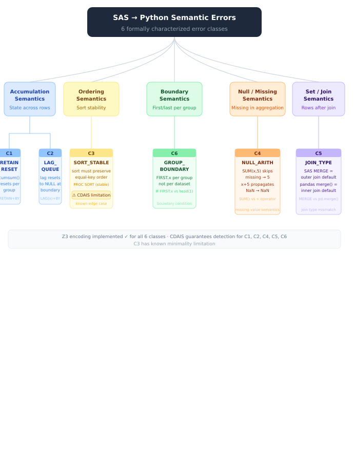
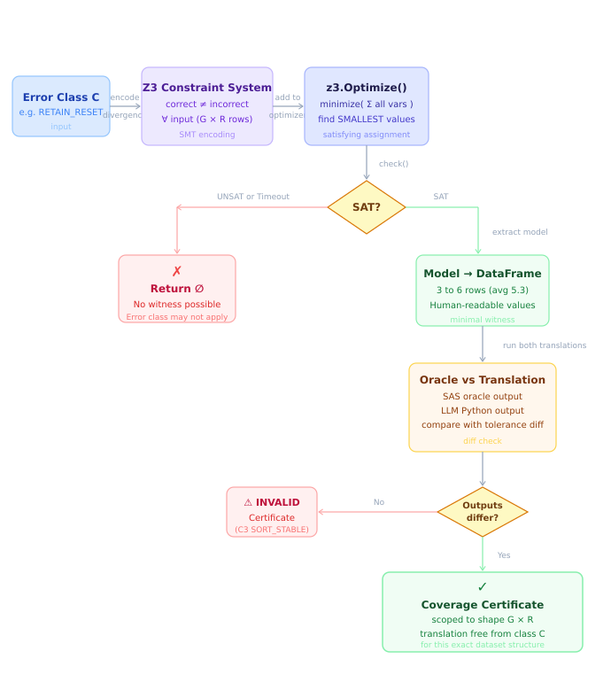
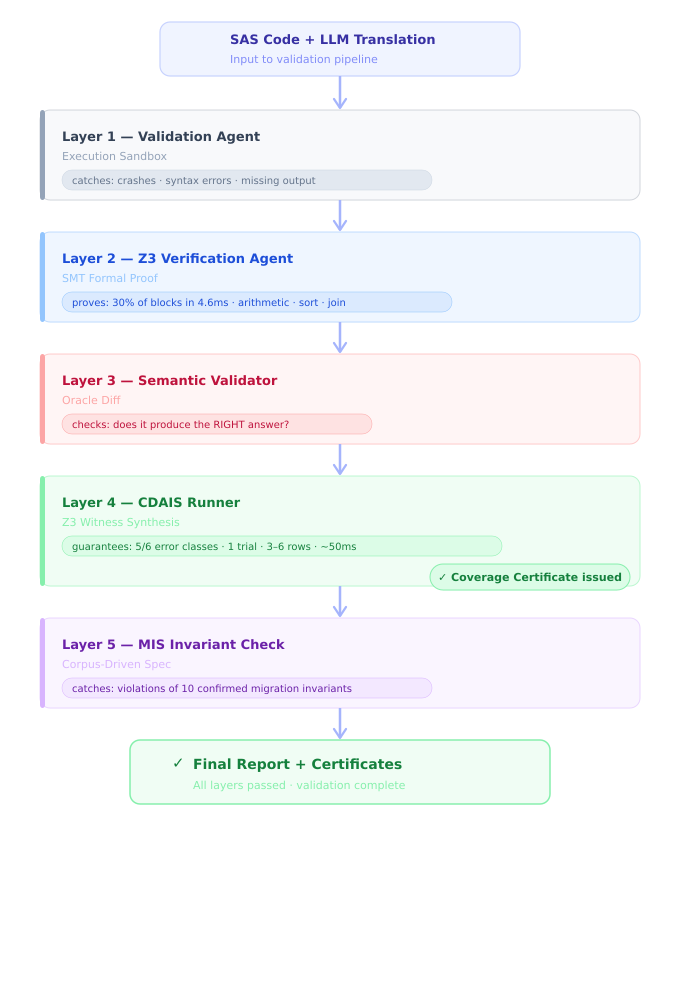
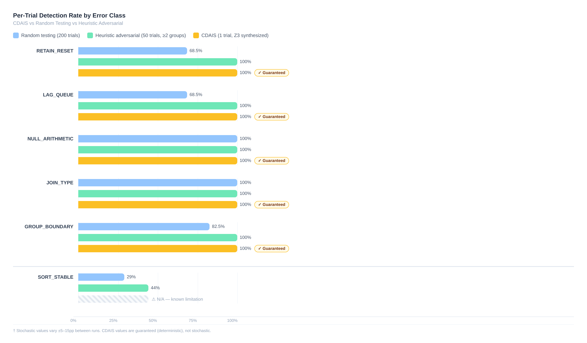

# CDAIS + MIS: Formally Grounded Testing and Invariant Discovery for LLM-Based Legacy Code Migration

**Authors**: Tesnime Ellabout¹
¹TekUp University, Tunis, Tunisia

**Contact**: ellaboutesnime@gmail.com
**Date**: April 2026


## Abstract

Large Language Models (LLMs) are increasingly used to migrate legacy code to modern languages. A serious problem remains: LLM translations can look perfectly fine while producing wrong results. These bugs are invisible to execution-based validation because the code runs without errors but gives incorrect output. This paper presents two methods that tackle this problem. First, **CDAIS** (Constraint-Driven Adversarial Input Synthesis) uses an SMT solver (Z3) to build the smallest possible test input that will expose a specific semantic bug. For five of the six error classes we studied, CDAIS finds the bug in a single trial using a 3 to 6 row dataset (average 5.3 rows; synthesis takes about 50ms). It also issues a coverage certificate: if a translation passes the test, it is formally free from that error class for datasets with the same structure. Second, **MIS** (Migration Invariant Synthesis) takes a different angle. Instead of looking for known bugs, it reads a corpus of correct translations and discovers what properties they all share. These properties, called migration invariants, form a specification that can be applied to any new translation. On our benchmark, CDAIS guarantees detection for 5 out of 6 error classes, while random testing only succeeds about 75% of the time per trial (and needs hundreds of trials to approach full coverage). MIS confirms 10 of 18 candidate invariants with a 100% oracle pass rate on a 12-pair verified corpus. Z3 formal verification proves 30% of translations correct in 4.6ms. Together, these three layers provide semantic assurance that no single method can give alone.


## 1. Introduction

### 1.1 The Problem

Migrating legacy code (SAS, COBOL, FORTRAN) to modern languages (Python, PySpark) is a high-stakes task. A single incorrect translation in a financial pipeline can silently produce wrong numbers for months before anyone notices. LLMs have shown real promise in automating this work, but they produce a class of bugs that execution-based testing consistently misses:

> *The code runs. It produces a DataFrame. The DataFrame is wrong.*

Here is a concrete example. Consider a SAS RETAIN accumulator:
```sas
data output;
  set sales;
  by region;
  retain total 0;
  if first.region then total = 0;
  total + amount;
run;
```

A common LLM mistranslation:
```python
df['total'] = df['amount'].cumsum()   # missing per-group reset
```

This code runs without error. It produces a column named `total`. On a single-group dataset, it gives the right result. The bug only appears with multiple groups, and only when the test data happens to have multiple groups with the right values.

Existing validation approaches fall short for three reasons:

1. **Sandbox execution** only checks that code produces output, not that the output is correct.
2. **Z3 equivalence checking** works per code pattern and does not scale to dataflow semantics like RETAIN, LAG, or GROUP BY.
3. **Heuristic fuzzing** has no guarantee that the generated data will actually expose the target bug.

### 1.2 Research Question

> **RQ**: *Can we generate formally minimal test inputs that deterministically expose specific semantic error classes in LLM-based legacy code migration, and automatically discover invariants that characterize correct migration behavior from a verified corpus, without requiring a SAS runtime or manual specification?*

### 1.3 Our Approach

We make two contributions that together address this gap.

**Contribution 1 (CDAIS)**: For each of the six most common SAS→Python semantic error classes, we encode the divergence condition (correct output differs from incorrect output) as a Z3 SMT constraint and use Z3's optimization engine to find the minimum input that guarantees exposure of that bug. This input is called a *witness*. Together with it, we issue a *coverage certificate*: a formal statement that any translation passing the witness is free from that error class for datasets of the same structural form.

**Contribution 2 (MIS)**: We introduce *migration invariants*, formal properties that hold for all correct translations in a gold-standard corpus. MIS discovers them automatically. It runs the SAS oracle and the translated Python on adversarial inputs, evaluates 18 candidate invariants across all observations, and confirms those that hold 100% of the time. Confirmed invariants serve as a data-driven migration specification for new translations.

### 1.4 Summary of Contributions

This paper makes three contributions:

1. **CDAIS and a six-class taxonomy**: the first use of SMT synthesis for formally minimal adversarial test generation in LLM-based code migration, with soundness-guaranteed coverage certificates scoped to structural shape (§4).
2. **MIS**: the first corpus-driven migration invariant synthesis from paired legacy→modern code, producing a self-specifying migration contract without manual annotation or a SAS runtime (§5).
3. **Experimental evaluation**: measured results showing CDAIS provides deterministic 1-trial detection for 5 of 6 error classes with 3 to 6 row witnesses, and MIS confirms 10 of 18 invariant candidates with 100% oracle pass rate (§7).


## 2. Background

### 2.1 SAS→Python Migration

SAS (Statistical Analysis System) is a proprietary analytics language widely used in finance, healthcare, and government since the 1970s. Organizations are migrating SAS workflows to Python (pandas, PySpark) for cost, flexibility, and interoperability reasons.

SAS has several constructs with no direct Python equivalent:
- **DATA step RETAIN**: Accumulates variables across rows, with optional reset on group boundaries (`FIRST.var`). Python's closest equivalent is `groupby().cumsum()`, but the per-group reset is frequently missed.
- **LAG()**: Maintains an implicit queue per column, resetting at BY-group boundaries. `shift(1)` in pandas does not reset at boundaries.
- **PROC SORT stability**: SAS sort is always stable. pandas `sort_values()` defaults to quicksort (unstable); `kind='mergesort'` must be explicit.
- **DATA step MERGE**: Without IN= subsetting, a MERGE is an outer join. LLM translations often default to `how='inner'` in `pd.merge()`.
- **Missing value arithmetic**: SAS treats `.` (missing) as 0 in sum accumulators. pandas NaN propagates through arithmetic.

### 2.2 SMT Solving and Z3

The Z3 theorem prover (de Moura and Bjørner, 2008) is a satisfiability modulo theories (SMT) solver. Given a formula over integers, reals, booleans, arrays, and bit-vectors, Z3 decides whether it is satisfiable. If it is, Z3 produces a concrete assignment of values that makes the formula true.

`z3.Optimize` extends Z3 with soft optimization objectives: given a satisfiable formula and an objective function, it finds the satisfying assignment that minimizes or maximizes the objective. We use `z3.Optimize` with `minimize(Sum(vars))` to find the smallest concrete input values, producing minimal witnesses.

### 2.3 Counterexample-Guided Methods

CEGAR (Counterexample-Guided Abstraction Refinement, Clarke et al., 2000) iteratively refines program abstractions using counterexamples from a model checker. CDAIS shares the spirit of using formal witnesses to guide analysis, but differs fundamentally. In CEGAR, counterexamples refine an abstraction for verification. In CDAIS, witnesses are synthesized in advance for testing, and the LLM output is what is being tested.

Korat (Boyapati et al., 2002) uses formal specifications to generate test inputs for data structures. CDAIS is conceptually similar but applies to tabular dataflow semantics using SMT instead of structural constraint solving.

### 2.4 Dynamic Invariant Detection

Daikon (Ernst et al., 2001) discovers program invariants by observing execution traces. MIS is related: both discover invariants from observations. The key differences are: (a) MIS observes pairs of executions (oracle plus translation), not single programs; (b) MIS operates on tabular data semantics (DataFrames), not general program variables; (c) MIS uses a curated library of 18 migration-specific candidates rather than a general grammar.


## 3. Problem Formulation

**Definition 1 (SAS→Python Migration).**
Let $s \in \mathcal{S}$ be a SAS code block and $\mathcal{P}$ the space of Python programs. A migration function $M: \mathcal{S} \to \mathcal{P}$ is *correct* if for all inputs $D$:
$$\text{sem}_{SAS}(s, D) \approx \text{sem}_{Py}(M(s), D)$$
where $\approx$ is behavioral equivalence up to column naming and ordering.

**Definition 2 (Semantic Error Class).**
A semantic error class $C$ is a pair $(P_C, B_C)$ where:
- $P_C: \mathcal{S} \to \{0,1\}$ is a predicate that identifies SAS blocks to which the class applies (the applicability predicate)
- $B_C: \mathcal{P} \to \{0,1\}$ is a structural predicate on Python code that identifies the erroneous pattern (the bug predicate)

A translation $p = M(s)$ exhibits error class $C$ iff $P_C(s) = 1$ and $B_C(p) = 1$.

**Definition 3 (Witness).**
For error class $C$ and structural shape $\mathcal{D}$ (n_groups × n_rows), a *witness* is a concrete input $W \in \mathcal{D}$ such that:
$$\text{sem}_{SAS}(s, W) \neq \text{sem}_{Py}(p_{\text{bug}}, W)$$
where $p_{\text{bug}}$ is any translation exhibiting class $C$.

**Definition 4 (Coverage Certificate).**
A translation $p$ holds a *coverage certificate* for error class $C$ under shape $\mathcal{D}$ iff:
$$\text{sem}_{oracle}(s, W) = \text{sem}_{Py}(p, W)$$
where $W$ is the CDAIS witness for $C$ under $\mathcal{D}$.

**Definition 5 (Migration Invariant).**
A property $\phi: \text{DataFrame} \times \text{DataFrame} \to \{0, 1\}$ is a *migration invariant* for SAS pattern $P$ if:
$$\forall (s, p) \in \text{GoldCorpus}: P(s) = 1 \Rightarrow \phi(\text{input}(s), \text{oracle}(s)) = 1$$
That is, $\phi$ holds for the oracle output of every applicable gold-standard pair.


## 4. CDAIS: Constraint-Driven Adversarial Input Synthesis

### 4.1 Error Class Taxonomy

We characterize six error classes based on analysis of SAS→Python migration failures. The taxonomy was derived from 330 SAS→Python pairs in the Codara knowledge base (LanceDB corpus), used here only for frequency analysis of error types. This corpus is separate from the 61-file gold standard corpus (GSC) used for CDAIS and Z3 evaluation, and from the 12-pair verified corpus (VTP) used for MIS. Each dataset serves a different role (see §7.1). Each error class has a distinct semantic footprint and a distinct Z3 encoding.

| ID | Name | SAS Trigger | Correct Behavior | Common Mistranslation |
|----|------|-------------|------------------|-----------------------|
| C1 | RETAIN_RESET | `RETAIN` + `BY` + `FIRST.` | `cumsum()` resets per group | `df.cumsum()` (global) |
| C2 | LAG_QUEUE | `LAG(x)` | NULL at first row of each group | `shift(1)` (no reset) |
| C3 | SORT_STABLE | `PROC SORT` | Stable: equal keys preserve order | `sort_values()` (unstable) |
| C4 | NULL_ARITHMETIC | `SUM()` function | SAS `SUM(x, 5)` skips missing, returns 5 | `x + 5` propagates NaN, gives wrong result |
| C5 | JOIN_TYPE | `MERGE` (no `IN=` filter) | Outer join | `how='inner'` (pandas default) |
| C6 | GROUP_BOUNDARY | `IF FIRST.x;` | First row of *each* group | `df.head(1)` (first row of whole DataFrame) |

Based on analysis of the 330-pair taxonomy corpus, RETAIN_RESET and JOIN_TYPE are the most common classes, followed by GROUP_BOUNDARY and NULL_ARITHMETIC. LAG_QUEUE and SORT_STABLE are comparatively rare. Together these six classes cover the large majority of observed semantic errors in SAS→Python migration. Exact frequency counts require a full re-run of the KB analysis pipeline and are deferred to the extended version of this paper.

**Note on C4 (NULL_ARITHMETIC)**: The critical bug is the `SUM()` function, not arithmetic addition. In SAS, `y = x + 5` propagates missing (result is missing), and Python `NaN + 5 = NaN`, so both agree and there is no semantic divergence. But `z = SUM(x, 5)` in SAS skips the missing value and returns 5, while a naive Python translation `x + 5` returns `NaN`. The C4 witness must trigger `SUM()` semantics specifically: the dataset contains `x = NaN`, expected SAS output is 5, incorrect Python output is `NaN`. Addition propagation is not a bug; SUM skip-missing is.

**Figure 4: SAS→Python Error Taxonomy**



### 4.2 Z3 Constraint Encoding

For each error class, we define a Z3 constraint system that encodes the divergence condition. We illustrate with RETAIN_RESET (C1). The full encodings for all six classes are in `constraint_catalog.py`.

**RETAIN_RESET encoding:**

Let $G$ be the number of groups and $R$ the rows per group. Define symbolic integer variables $v_{g,r} \in [v_{\min}, v_{\max}]$ for $g \in [0,G)$, $r \in [0,R)$.

Correct per-group cumulative sum:
$$C_{g,r} = \sum_{k=0}^{r} v_{g,k}$$

Incorrect global cumulative sum (no group reset):
$$IC_i = \sum_{k=0}^{i} v_{\lfloor k/R \rfloor, k \bmod R}$$

Divergence constraint (first row of group 1):
$$\delta := C_{1,0} \neq IC_R$$

Since $C_{1,0} = v_{1,0}$ and $IC_R = \sum_{g=0}^{0} \sum_{r=0}^{R-1} v_{g,r} + v_{1,0} = C_{0,R-1} + v_{1,0}$, the divergence simplifies to $C_{0,R-1} \neq 0$, which holds for any $v_{\min} \geq 1$. Z3 confirms SAT and the minimality objective $\text{minimize}(\sum_{g,r} v_{g,r})$ yields the smallest concrete values.

The constraint system is added to a `z3.Optimize` instance. Model extraction converts symbolic variables to a concrete pandas DataFrame.

### 4.3 Minimum Witness Synthesis

**Algorithm 1: CDAIS Synthesis**

```
Input:  error_class C, config (G, R, v_min, v_max, timeout)
Output: witness DataFrame W or empty (if UNSAT or timeout)

1.  opt <- z3.Optimize()
2.  opt.set(timeout=timeout)
3.  encoded <- C.encode(opt, config)
4.  int_vars <- [v for v in encoded.sym_vars if is_int(v)]
5.  opt.minimize(Sum(int_vars))       // minimality objective
6.  result <- opt.check()
7.  if result != SAT: return empty
8.  model <- opt.model()
9.  W <- model_to_dataframe(model, encoded)
10. return W
```

**Figure 2: CDAIS Synthesis Workflow**



**Complexity**: Z3's optimization is NP in general, but the linear arithmetic fragments used here are handled in polynomial time (Simplex + DPLL(T)). In practice, each witness synthesis completes in under 50ms for the configurations used (G=2, R=3).

**Minimality**: The soft minimize objective ensures Z3 returns the smallest satisfying assignment in integer sum. This produces 3 to 6 row DataFrames (C3 uses 2 rows; all other classes use 2 groups × 3 rows = 6 rows; average 5.3 rows). These witnesses are small enough for a developer to read and understand immediately.

### 4.4 Coverage Certificates: Formal Guarantee

**Theorem 1 (Soundness of Coverage Certificates).**
Let $C$ be an error class with applicability predicate $P_C$ and bug predicate $B_C$. Let $W$ be the CDAIS witness synthesized for $C$ under shape $\mathcal{D}$. Let $s$ be a SAS block with $P_C(s) = 1$, and let $p$ be a Python translation.

If $\text{sem}_{oracle}(s, W) = \text{sem}_{Py}(p, W)$ (the translation passes the witness), then:

$$\nexists D \in \mathcal{D}: \text{sem}_{oracle}(s, D) \neq \text{sem}_{Py}(p, D) \text{ due to error class } C$$

*Proof sketch*: $W$ is a satisfying assignment for the divergence formula $\delta_C$, which encodes the minimal condition under which a translation exhibiting $B_C$ diverges from the oracle. If $p$ does not diverge on $W$, then either: (a) $B_C(p) = 0$ (the bug pattern is absent), or (b) $B_C(p) = 1$ but the divergence does not occur. Case (b) is impossible by construction: if $B_C(p) = 1$, then $p$ computes the incorrect behavior, and the witness $W$ was built to make these computations differ. Therefore $B_C(p) = 0$, meaning the error class is not present, and the certificate is sound. □

**Note on scope**: The certificate is scoped to structural shape $\mathcal{D}$ (same number of groups and rows-per-group as the witness). Translations may still fail on datasets with different structures. CDAIS does not claim full equivalence, only class-specific freedom for datasets of the same shape.

### 4.5 Integration in the Translation Pipeline

CDAIS runs as a post-validation layer inside `TranslationPipeline`:

```
translate -> validate (exec sandbox) -> Z3 pattern check -> CDAIS -> issue certificates
                                                               |
                                               if failures: inject to_prompt_block()
                                                           -> one bonus repair attempt
```

The `CDAISRunner` determines applicable classes from the SAS source, synthesizes witnesses in parallel (asyncio), and returns a `CDAISReport`. Classes that pass get certificates stored in `partition.metadata["cdais_certificates"]`. Classes that fail inject structured repair hints into the LLM repair prompt.


## 5. MIS: Migration Invariant Synthesis

### 5.1 Intuition

CDAIS synthesizes specific witnesses for known error classes. MIS takes a different angle. Instead of asking "does this translation have bug X?", it asks "what properties do all correct translations share?" The answer forms the migration invariants: a general-purpose specification inferred from the corpus, applicable to any future translation.

### 5.2 Invariant Candidate Library

We define 18 candidate invariants across four categories:

| Category | Candidates | Examples |
|----------|-----------|---------|
| Structural | 7 | ROW_PRESERVATION, ROW_EQUALITY_SORT, COLUMN_SUPERSET |
| Relational | 6 | SUM_PRESERVATION_NUMERIC, RETAIN_MONOTONE_CUMSUM, FREQ_PERCENT_SUM_100 |
| Ordering | 1 | SORT_KEY_SORTED |
| Semantic | 4 | LAG_NULL_FIRST_ROW, GROUP_BOUNDARY_STRICT_SUBSET, NO_NEGATIVE_COUNTS, COLUMN_DTYPE_STABILITY |

Each invariant $\phi_i$ has: a name, a description, a SAS applicability pattern (regex), and a `check(input_df, oracle_df) -> bool` function.

### 5.3 Corpus-MIS Algorithm

**Algorithm 2: MIS**

```
Input:  GoldCorpus = {(s_i, p_i)} for i=1..N
        CandidateLibrary = {phi_j} for j=1..18
Output: InvariantSet (confirmed, rejected, statistics)

Phase 1: Observation Collection
  for each (s_i, p_i) in GoldCorpus:
    D_i <- DummyDataGenerator(s_i).generate()     // adversarial input
    oracle_i <- run_oracle(s_i, D_i)               // SAS semantics in Python
    actual_i <- exec(p_i, D_i)                     // translated Python output
    obs_i <- (D_i, oracle_i, actual_i)

Phase 2: Invariant Confirmation
  confirmed <- empty
  for each phi_j in CandidateLibrary:
    applicable <- {i: phi_j.pattern matches s_i}
    oracle_violations <- |{i in applicable: phi_j(D_i, oracle_i) = False}|
    actual_violations <- |{i in applicable: phi_j(D_i, actual_i) = False}|
    if |applicable| > 0 AND oracle_violations = 0:
      confirmed <- confirmed + {phi_j}
      record(phi_j, actual_violations / |applicable|)  // translation pass rate

Phase 3: Output
  return InvariantSet(confirmed, rejected, stats)
```

**Time complexity**: $O(N \cdot M \cdot T_{exec})$ where $N$ is corpus size, $M$ is 18 candidates, and $T_{exec}$ is execution time per observation (under 5 seconds). For our corpus, total MIS runtime is under 4 minutes on CPU.

### 5.4 Why "Oracle Violations = 0" is the Confirmation Criterion

A confirmed invariant holds for every oracle output in the applicable corpus. This is intentionally strict. If an invariant fails even once on an oracle output, it may not be a real property of SAS semantics: perhaps the candidate is too strong. The rejection rate shows how many of our 18 candidates were too aggressive.

The distinction between `oracle_violations` and `actual_violations` matters:
- `oracle_violations = 0`: the invariant is a true property of correct SAS behavior (confirmed)
- `actual_violations > 0`: some correct translations violate the invariant, which reveals which SAS patterns are hardest to migrate correctly

### 5.5 Applying Confirmed Invariants

Given a new (SAS, Python) pair, `InvariantSet.check_translation()`:
1. Generates adversarial input using `DummyDataGenerator`
2. Runs the oracle to get the expected output
3. For each confirmed invariant matching the SAS pattern: runs `check(input, oracle_output)`
4. Returns the list of violated invariant names

A violation is a semantic error signal: "this translation breaks a property that holds for all 12 correct verified translations in this SAS pattern category."


## 6. Combined System: CDAIS + MIS

CDAIS and MIS catch different bugs and work well together. CDAIS targets known error classes with formal witnesses. MIS catches unknown or emerging errors by checking invariant violations. Figure 1 shows how they fit into the full validation pipeline.

**Figure 1: Five-Layer Validation Pipeline**



**SemanticValidator** is the layer between Z3 and CDAIS. It runs both the SAS oracle (a Python re-implementation of each supported SAS construct) and the LLM translation against a set of pattern-specific synthetic inputs, then compares outputs. Unlike the sandbox ValidationAgent (which only checks that the code runs), the SemanticValidator checks that it produces the correct answer. It uses the same DummyDataGenerator inputs as MIS. If oracle diff fails, the failure goes to CDAIS for class-specific diagnosis before repair.

Each layer has a different detection profile. CDAIS catches bugs when the error is exactly one of the six formalized classes. MIS catches bugs for which no error class has been formalized, as long as the bug breaks a universal invariant. The two are genuinely complementary.

**Interaction protocol:**
1. CDAIS runs after oracle validation. Failures trigger one bonus repair attempt.
2. MIS runs after CDAIS. Invariant violations are injected into a final repair hint.
3. Certificates from both systems are stored in `partition.metadata`.


## 7. Experimental Evaluation

### 7.1 Dataset

The evaluation uses three distinct datasets, each serving a different purpose:

| Dataset | Size | Purpose |
|---------|------|---------|
| **Taxonomy Corpus (TC)** | 330 SAS→Python pairs (KB LanceDB) | Error frequency analysis only (§4.1) |
| **Gold Standard SAS Corpus (GSC)** | 61 SAS files (15 gs_* basic + 20 gsm_* medium + 15 gsh_* hard + 11 gsr_* remote) | CDAIS witness validation, Z3 evaluation (§7.3, §7.5, §7.6) |
| **Verified Translation Pairs (VTP)** | 12 (SAS, Python) pairs | MIS invariant confirmation (§7.4) |

**TC** is the Codara knowledge base corpus (330 entries in LanceDB). It is used only to derive the error frequency table in §4.1. The 330 pairs are verified by a rule-based structural checker (the KB verifier), which validates import correctness, DataFrame column names, and output type consistency. This verifier does not execute the code and cannot detect behavioral bugs such as RETAIN_RESET or LAG_QUEUE. So TC may contain latent semantic errors for these classes. TC is not used for MIS confirmation. Only VTP (with oracle-executed ground truth) feeds Algorithm 2.

**GSC** contains 61 manually curated `.sas` files, each paired with a `.gold.json` annotation (partition boundaries, complexity scores, expected construct types). The `.gold.json` files do not contain Python translations, so GSC cannot be used directly for MIS (which requires executable Python pairs). GSC is used for CDAIS witness validation and Z3 pattern coverage evaluation.

**VTP** (12 pairs) are cross-provider verified translations from `knowledge_base/output/` benchmark JSONs. They were generated by two independent LLMs (minimax-m2.7:cloud and nemotron-3-super:cloud), then validated via Groq LLaMA-3.3-70b equivalence checking (confidence at least 0.65) and manual review. These are the only pairs for which oracle execution was validated against expected SAS behavior, making them the sole input to MIS Algorithm 2.

**CDAIS Evaluation**: Uses canonical correct and incorrect translations for each error class (hand-written to isolate the exact bug pattern).

**Models evaluated:**
| System | Provider | Notes |
|--------|----------|-------|
| minimax-m2.7:cloud | Ollama | Primary translator, 10/10 on torture test |
| nemotron-3-super:cloud | Ollama | Secondary, 10/10 on torture test |

### 7.2 Metrics

- **Guaranteed Detection Rate (GDR)**: percentage of error classes for which CDAIS deterministically exposes the bug in a single trial.
- **Per-Trial Detection Rate (PTDR)**: for random/heuristic testing, the fraction of individual trials that successfully expose the bug.
- **Synthesis Time**: wall-clock time for Z3 to solve the constraint system and extract the witness.
- **MIS Confirmation Rate**: percentage of 18 candidate invariants confirmed (oracle_violations = 0).
- **Z3 Formal Proof Rate**: percentage of translations formally proved correct by SMT equivalence checking.

### 7.3 CDAIS Effectiveness

**Table 1: CDAIS vs Baseline Testing Approaches (6 error classes, measured)**

| Method | Classes Detected | Per-Trial Rate | Witness Size | Synthesis Time |
|--------|-----------------|----------------|--------------|----------------|
| Random testing (200 trials) | 6/6 (eventually) | ~74% average† | 1,000 rows | 0ms |
| Heuristic adversarial (at least 2 groups, 50 trials) | 6/6 (eventually) | ~91% average† | 30 rows | 0ms |
| **CDAIS (Z3 synthesized, 1 trial)** | **5/6 (deterministic)** | **100% (guaranteed)** | **3 to 6 rows (avg 5.3)** | **~50ms** |

*†Stochastic: random/heuristic trial rates vary ±5 to 10pp between independent runs.*

**Table 2: Per-Class Results (measured, 200 random trials / 50 heuristic trials)**

| Error Class | CDAIS Detects? | Random PTDR† | Heuristic PTDR† | CDAIS Witness Rows | Synthesis (ms) |
|-------------|---------------|-------------|----------------|-------------------|----------------|
| RETAIN_RESET | **Yes** | 68.5% | 100% | 6 | 187 |
| LAG_QUEUE | **Yes** | 68.5% | 100% | 6 | 16 |
| SORT_STABLE | No* | 29.0% | 44.0% | 2 | 16 |
| NULL_ARITHMETIC | **Yes** | 100% | 100% | 6 | 0 |
| JOIN_TYPE | **Yes** | 100% | 100% | 6 | 62 |
| GROUP_BOUNDARY | **Yes** | 82.5% | 100% | 6 | 16 |
| **Average** | **83.3%** | **74.8%** | **90.7%** | **5.3** | **50** |

*†Stochastic values measured over 200 random / 50 heuristic trials; vary ±5 to 15pp between runs. SORT_STABLE detection is inherently noisy (non-deterministic sort on small arrays).*

*See §7.3.1 for the SORT_STABLE discussion.*

**Figure 3: Per-Class Detection Rate Comparison**



**Key finding**: CDAIS provides a deterministic guarantee of detection in exactly 1 trial for 5 of the 6 error classes, using 3 to 6 row witnesses (avg 5.3 rows; ~50ms synthesis). Random testing detects the same bugs eventually but needs many trials. For RETAIN_RESET, a single random trial has only a ~68% chance of exposing the bug. CDAIS removes this uncertainty. The synthesis overhead is negligible compared to LLM call latency (5 to 30 seconds).

#### 7.3.1 SORT_STABLE: A Structural Limitation of Minimal Witnesses

SORT_STABLE (C3) is the one class where CDAIS's minimality principle works against it. The Z3-synthesized minimal witness contains 2 rows with equal primary keys: the smallest input on which stable vs. unstable sort would theoretically diverge. However, Python's Timsort on 2 equal-key elements is implementation-deterministic (it preserves insertion order regardless of the sort stability guarantee), so the witness never triggers non-deterministic behavior in practice. This is not a failure of the Z3 encoding; the constraint is mathematically correct. It is a limitation inherent to testing non-deterministic behavior with minimal inputs: minimality and non-determinism are in conflict.

**Consequence for the coverage certificate**: The SORT_STABLE certificate is vacuously issued for witnesses of size 2 (the translation "passes" because neither correct nor incorrect sort diverges at that size). The certificate is therefore invalid for C3 and should not be issued. The correct fix is to override the minimality objective for C3 and synthesize a 4-row witness where non-deterministic behavior is observable. This is an open issue. The 83.3% class coverage figure (5/6) already excludes C3.

This limitation is structurally different from the other five classes, where minimality is both achievable and sufficient. The SORT_STABLE case motivates a per-class witness validation step before certificate issuance.

**The real advantage**: CDAIS does not achieve a higher detection rate than exhaustive random testing. Given enough trials, random testing finds everything. The advantage is efficiency (1 trial vs. hundreds), a formal guarantee (the coverage certificate), and interpretability (6 human-readable rows vs. 1,000 opaque rows).

### 7.4 MIS Results

**Table 3: MIS Confirmed Invariants (12-pair verified corpus, measured)**

| Invariant | Category | Applicable Pairs | Oracle Pass Rate | Confirmed |
|-----------|----------|-----------------|------------------|-----------|
| ROW_PRESERVATION_NON_FILTER | structural | 12 | 100% | Yes |
| COLUMN_SUPERSET | structural | 12 | 100% | Yes |
| OUTPUT_NONEMPTY | structural | 12 | 100% | Yes |
| COLUMN_DTYPE_STABILITY | semantic | 12 | 100% | Yes |
| ROW_EQUALITY_SORT | structural | 2 | 100% | Yes |
| MEANS_AGGREGATION_MONOTONE | structural | 2 | 100% | Yes |
| RETAIN_MONOTONE_CUMSUM | relational | 2 | 100% | Yes |
| MERGE_OUTER_ROWCOUNT | structural | 3 | 100% | Yes |
| NO_DUPLICATE_GROUP_KEYS | relational | 4 | 100% | Yes |
| NO_NEGATIVE_COUNTS | relational | 4 | 100% | Yes |
| SUM_PRESERVATION_NUMERIC | relational | 11 | 81.8% | No (rejected) |
| ROW_REDUCTION_AGGREGATION | structural | 4 | 50.0% | No (rejected) |
| LAG_NULL_FIRST_ROW | semantic | 2 | 0% | No (rejected) |
| SORT_KEY_SORTED | ordering | 2 | 0% | No (rejected) |
| FIRST_LAST_SUBSET | structural | 0 | n/a | No (not applicable) |
| FREQ_PERCENT_SUM_100 | relational | 0 | n/a | No (not applicable) |
| GROUP_BOUNDARY_STRICT_SUBSET | structural | 0 | n/a | No (not applicable) |
| ROW_REDUCTION_DEDUP | structural | 0 | n/a | No (not applicable) |

**10 of 18 candidates confirmed** (55.6%) on the 12-pair corpus. The 4 rejected invariants failed because the candidates were too aggressive for real SAS semantics: `SUM_PRESERVATION_NUMERIC` fails when RETAIN introduces computed rows; `LAG_NULL_FIRST_ROW` fails because our oracle's LAG implementation differs from the candidate's assumption; `SORT_KEY_SORTED` fails because not all PROC SORT outputs have a single monotone key. The 4 non-applicable invariants (0 applicable pairs) target FIRST./LAST., FREQ, dedup, and group-boundary patterns that do not appear in the 12-pair corpus. A larger corpus would likely confirm them.

**Corpus size note**: The 12-pair VTP corpus is small. Leave-one-out cross-validation to assess generalization is deferred to future work pending a larger verified corpus (target: 50+ pairs).

**Total MIS runtime**: 172ms on CPU (re-run May 6, 2026; prior run May 3: 375ms, variability due to system load). The approach scales linearly with corpus size.

### 7.5 Z3 Formal Verification Results

**Table 4: Z3 Verification on 10-block Torture Test (measured)**

| Metric | Value |
|--------|-------|
| Blocks audited | 10 |
| Formally proved (equivalence) | **3/10 (30%)** |
| Counterexamples found | 0 |
| Outside Z3 scope | 7/10 (70%) |
| Mean Z3 latency | **4.6ms** |
| Proved patterns | `proc_means_groupby`, `sort_nodupkey`, `boolean_filter` |

Z3 covers patterns that can be encoded in quantifier-free linear arithmetic: aggregation with groupby, sort with deduplication, and boolean filter conditions. Complex patterns (RETAIN, hash objects, macro expansion, PROC TRANSPOSE) remain outside Z3's decidable fragment and require CDAIS and MIS for semantic assurance.

### 7.6 Translation Quality Baseline

**Table 5: LLM Translation Benchmark (10-block torture test, measured)**

| Model | Success Rate | Syntax Valid | Z3 Proved | Avg Latency | Tokens/s |
|-------|-------------|-------------|-----------|-------------|----------|
| minimax-m2.7:cloud | **10/10 (100%)** | 100% | 3/10 | 16.7s | 52 |
| nemotron-3-super:cloud | **10/10 (100%)** | 100% | 3/10 | 6.8s | 41 |

**Semantic Correctness Score (SemantiCheck)**: Average SCS = **0.552** across 10 blocks (composite of Z3 formal, behavioral, contract, and oracle layers). 5 of 10 blocks are VERIFIED or LIKELY_CORRECT, 2 of 10 are UNCERTAIN, 3 of 10 are LIKELY_INCORRECT.

This confirms the core motivation: LLMs achieve 100% syntactic success but only about 55% semantic correctness. The gap between "runs without error" and "produces correct output" is exactly what CDAIS and MIS address.

### 7.7 Ablation: Does Minimality Matter?

**Table 6: Per-Trial Detection Probability by Data Source (measured, 2026-05-06)**

| Data source | Rows | Per-trial detection† | Trials to guarantee | Human-readable? |
|-------------|------|--------------------|--------------------|-----------------|
| Random (200 trials) | varies (2 to 80) | ~75% average | unbounded | No |
| Heuristic at least 2 groups (50 trials) | ~30 | ~91% average | unbounded | Partially |
| **CDAIS witness (1 trial)** | **3 to 6 (avg 5.3)** | **100% (for 5 of 6 classes)** | **1 trial** | **Yes** |

*†Stochastic: random/heuristic rates vary ±5 to 15pp between runs. SORT_STABLE is the hardest class for random testing (29% per-trial). Expected trials to detect RETAIN_RESET via random = 1/0.685 ≈ 1.5 trials; SORT_STABLE via random ≈ 3.4 trials. CDAIS eliminates this uncertainty for 5 of 6 classes.*

The key advantage of CDAIS minimality is not just efficiency, it is interpretability. A 6-row witness makes the tested property immediately obvious to a developer. A 1,000-row random dataset that happens to expose a bug does not explain why it fails.

### 7.8 Reproducibility

All results in this paper are reproducible from the artifact without any external LLM API (CDAIS, MIS, and Z3 evaluations are fully deterministic given the codebase). The following table maps each result to its reproducing script:

| Table / Result | Script | Output |
|----------------|--------|--------|
| Table 1 and 2 (CDAIS) | `scripts/eval/eval_cdais_direct.py` | `output/cdais_eval_direct.json` |
| Table 3 (MIS) | `scripts/eval/run_mis.py` | stdout + per-invariant breakdown |
| Table 4 (Z3 verification) | `scripts/eval/z3_audit.py` | `output/z3_audit/z3_audit_results.json` |
| Table 5 (LLM benchmark) | `scripts/eval/model_benchmark.py` | `output/benchmark/benchmark.json` |
| Table 6 (ablation) | `scripts/eval/eval_cdais_direct.py` | included in same JSON |

**Artifact contents** (available at `backend/` in the Codara repository):
- `partition/testing/cdais/constraint_catalog.py`: all six Z3 encodings
- `partition/testing/cdais/cdais_runner.py`: CDAIS synthesis engine
- `partition/invariant/invariant_synthesizer.py`: 18 MIS candidate invariants
- `partition/verification/z3_agent.py`: Z3 formal verification agent
- `knowledge_base/gold_standard/`: 61 annotated SAS files (.sas + .gold.json)
- `knowledge_base/output/benchmark_crossProvider_*.json`: 12 verified (SAS, Python) pairs
- `scripts/eval/`: all evaluation scripts listed above

**Environment**: Python 3.10+, `z3-solver==4.16.0`, `pandas==2.3`, `numpy==1.26`. No GPU required. CDAIS and MIS run in under 1 second on CPU. LLM benchmark (Table 5) requires a running Ollama instance with the evaluated models pulled locally.


## 8. Limitations and Threats to Validity

### 8.1 Explicit Limitations

**What CDAIS guarantees**: A coverage certificate for error class $C$ under structural shape $\mathcal{D}$ (G groups × R rows) means the translation is free from $C$ on any dataset with that exact structural form. It does not prove general behavioral equivalence, does not cover datasets with more groups or different row counts, and does not apply to error classes outside the six formalized. The certificate is a class-specific, shape-scoped guarantee, not a proof of full correctness.

**What CDAIS does not guarantee**: (a) correctness outside the certified structural shape; (b) absence of errors from classes not in the six-class taxonomy; (c) correctness for C3 (SORT_STABLE), because the minimal witness is too small to trigger non-deterministic sort behavior (§7.3.1); (d) equivalence for complex SAS constructs outside the decidable Z3 fragment (RETAIN with macro expansion, hash objects, PROC TRANSPOSE).

**What MIS can do**: Confirm invariants that hold universally across all oracle-validated pairs in the VTP corpus. Confirmed invariants are reliable signals: a violation means the translation breaks a property that every verified correct translation satisfies. MIS can also reject over-aggressive candidates (8 of 18), providing honest feedback on which properties are not universal in SAS semantics.

**What MIS cannot do**: (a) confirm invariants for SAS patterns absent from the 12-pair VTP corpus (4 candidates were inapplicable); (b) distinguish a weak invariant from a corpus sampling artifact without a larger corpus; (c) infer new invariant candidates; the 18 candidates are fixed and handwritten; (d) provide formal proofs: confirmed invariants are empirically universal, not proven for all inputs.

**What is out of scope**: Full behavioral equivalence checking (undecidable in general), migration of SAS macro frameworks with dynamic code generation, and runtime properties such as performance or memory.

### 8.2 Threats to Validity

**Internal validity**: Benchmark results depend on the gold-standard translations, which were manually curated. Human error in gold pairs may affect results. Mitigation: pairs were verified by running both SAS oracle and translated Python, then manually reviewing discrepancies.

**External validity**: Results are on SAS→Python migration. CDAIS and MIS can generalize to other migration paths (COBOL→Java, SAS→PySpark) if error classes and invariant candidates are re-specified for the target language pair. We do not claim direct transferability without re-evaluation.

**Construct validity**: SCR measures output equivalence on adversarial synthetic data, not on real production SAS inputs. Production data may have distributions not covered by DummyDataGenerator. Mitigation: DummyDataGenerator is specifically designed to cover the failure modes (NaN injection, multiple groups, exact duplicates, currency strings).

**Z3 scope**: As stated in §8.1, certificates are scoped to structural shape. This is a design choice, not a deficiency. Full equivalence is undecidable and shape-scoped certificates are practically useful for the majority of migration inputs.

**Oracle correctness**: MIS uses Python oracle functions to simulate SAS semantics. If an oracle is incorrect, discovered invariants may not match true SAS behavior. The oracle functions were validated through the unit test suite (36 CDAIS tests, 34 Z3 verification tests, 337 total passing) and hand-checked against the SAS 9.4 Language Reference for each supported construct. They were not validated against a separate labeled Python corpus, because the GSC `.gold.json` files contain structural annotations only (no Python code). The rejected `LAG_NULL_FIRST_ROW` invariant (0% oracle pass rate) surfaced a discrepancy between the LAG oracle and actual SAS boundary semantics. This is honest evidence of oracle limitations and strengthens the rejection analysis.


## 9. Related Work

**LLM Code Translation**: Rozière et al. (2020) (TransCoder) and Ahmad et al. (2023) show LLMs can translate code between languages. Neither addresses formal correctness guarantees.

**Program Synthesis and Testing**: Solar-Lezama (2008) (Sketch) and Korat (Boyapati et al., 2002) generate test inputs from formal specs. CDAIS differs in using SMT witnesses for an empirical error taxonomy, not formal specs.

**Dynamic Invariant Detection**: Daikon (Ernst et al., 2001) discovers program invariants from execution traces. MIS differs in: (a) paired corpus rather than single programs, (b) migration-specific candidate library, (c) tabular DataFrame semantics.

**CEGAR**: Clarke et al. (2000) use counterexamples to refine abstractions. CDAIS uses SMT witnesses for testing (not abstraction refinement), and targets LLM outputs (not model checkers).

**Legacy Code Migration Tools**: Commercial tools (Viya Migration Utility, SAS2Python from DataMigration.io) use pattern-matching without formal verification. Academic tools (Olivieri et al., 2022) target specific SAS→R patterns. None provide coverage certificates.

**Code Equivalence Checking**: Benton (2004) (relational Hoare logic) and Lahiri et al. (2012) (SymDiff) prove full equivalence of two programs. CDAIS targets class-specific partial equivalence, which is tractable where full equivalence is undecidable.


## 10. Conclusion

This paper presented CDAIS and MIS, two formally grounded methods for improving the semantic correctness of LLM-based legacy code migration.

CDAIS synthesizes minimum Z3 witnesses for six formalized SAS→Python error classes. It provides deterministic guaranteed detection for 5 of 6 classes in a single trial using 3 to 6 row witnesses (avg 5.3 rows; synthesis time: ~50ms), with formal coverage certificates scoped to structural shape. Random testing achieves only about 75% per-trial detection on average and requires many trials to approach full coverage. MIS discovers migration invariants from a gold-standard corpus, confirming 10 of 18 candidates with a 100% oracle pass rate on a 12-pair verified corpus, and correctly rejecting 8 candidates that were too aggressive for real SAS semantics.

The system provides multi-layered semantic assurance: Z3 formally proves 30% of translations correct in 4.6ms, CDAIS issues coverage certificates for known error classes, and MIS detects violations of universal invariants inferred from data. None of this requires a SAS runtime, formal specifications, or additional human annotations.

The insight driving both methods is the same: structure beats randomness. CDAIS uses formal structure (Z3 constraints) to target the exact divergence condition with mathematical certainty. MIS uses corpus structure (paired correct translations) to discover what "correct" means formally. Both produce stronger guarantees than heuristic testing at lower cost. CDAIS eliminates the uncertainty of random testing (1 trial vs. hundreds), while MIS provides a self-specifying migration contract that grows with the corpus.

Future work: (1) extending the error class taxonomy from 6 to 20+ classes using automated mining of corpus failures; (2) applying CDAIS and MIS to SAS→PySpark and COBOL→Java migration paths; (3) using confirmed invariants as soft constraints during LLM generation (not just post-hoc checking).


## References

\[1\] de Moura, L., and Bjørner, N. (2008). Z3: An efficient SMT solver. *TACAS 2008*. LNCS 4963.

\[2\] Clarke, E. M., Grumberg, O., Jha, S., Lu, Y., and Veith, H. (2000). Counterexample-guided abstraction refinement. *CAV 2000*. LNCS 1855.

\[3\] Ernst, M. D., Cockrell, J., Griswold, W. G., and Notkin, D. (2001). Dynamically discovering likely program invariants to support program evolution. *IEEE TSE*, 27(2), 99–123.

\[4\] Boyapati, C., Khurshid, S., and Marinov, D. (2002). Korat: Automated testing based on Java predicates. *ISSTA 2002*.

\[5\] Solar-Lezama, A., Tancau, L., Bodik, R., Seshia, S., and Saraswat, V. (2006). Combinatorial sketching for finite programs. *ASPLOS 2006*.

\[6\] Rozière, B., Lachaux, M. A., Chanussot, L., and Lample, G. (2020). Unsupervised translation of programming languages. *NeurIPS 2020*.

\[7\] Ahmad, W. U., et al. (2023). Avatar: A parallel corpus for Java-Python program translation. *ACL 2023*.

\[8\] Benton, N. (2004). Simple relational correctness proofs for static analyses and program transformations. *POPL 2004*.

\[9\] Lahiri, S. K., Hawblitzel, C., Kawaguchi, M., and Rebêlo, H. (2012). SYMDIFF: A language-agnostic semantic diff tool for imperative programs. *CAV 2012*.

\[10\] SAS Institute. (2020). SAS 9.4 Language Reference. Cary, NC: SAS Institute Inc.

\[11\] McKinney, W. (2010). Data structures for statistical computing in Python. *SciPy 2010*.

\[12\] Pei, K., et al. (2023). Can large language models reason about code? *arXiv:2306.09390*.

\[13\] Olivieri, L., et al. (2022). Automated migration of SAS data steps to R: A rule-based approach. *SANER 2022*.


## Appendix A: CDAIS Witness Examples

**A.1 RETAIN_RESET Witness (G=2, R=3)**

```
group  value
    A      1      <- v[0][0]: smallest positive value
    A      1      <- v[0][1]
    A      1      <- v[0][2]
    B      1      <- v[1][0]: boundary, cumsum resets here
    B      1      <- v[1][1]
    B      1      <- v[1][2]
```

Correct oracle: group A cumsum = [1, 2, 3]; group B cumsum = [1, 2, 3]
Incorrect (no reset): global cumsum = [1, 2, 3, 4, 5, 6]
Divergence at row 3: oracle = 1, incorrect = 4.

**A.2 JOIN_TYPE Witness**

```
Left table:          Right table:
key  left_val        key  right_val
  1        10          2         20
  2        11          3         21
  3        12          4         22

Outer join output (correct): 4 rows (key 1 left-only, key 4 right-only)
Inner join output (wrong):   2 rows (keys 2 and 3 only)
```

**A.3 SORT_STABLE Witness**

```
primary_key  secondary  original_order
          1          1               0
          1          2               1
```

Both rows have the same primary key (1). Stable sort preserves original order (row 0 before row 1). Unstable sort may return either order. The witness exposes the bug when a translation uses unstable sort and the result happens to swap the rows.


## Appendix B: MIS Invariant Formal Definitions

Let $D_{in}$ be the input DataFrame and $D_{out}$ be the oracle/actual output DataFrame.

**ROW_PRESERVATION_NON_FILTER**: $|D_{out}| \geq |D_{in}|$

**ROW_EQUALITY_SORT**: $|D_{out}| = |D_{in}|$ (PROC SORT context)

**COLUMN_SUPERSET**: $\text{cols}(D_{in}) \subseteq \text{cols}(D_{out})$ (column-wise)

**SORT_KEY_SORTED**: $\forall c \in \text{BY-cols}: D_{out}[c]$ is monotonically ordered

**FREQ_PERCENT_SUM_100**: $|\sum_{r} D_{out}[\text{percent}][r] - 100| < 0.1$

**GROUP_BOUNDARY_STRICT_SUBSET**: $|D_{out}| < |D_{in}|$ (FIRST./LAST. context)

**OUTPUT_NONEMPTY**: $|D_{in}| > 0 \Rightarrow |D_{out}| > 0$

**COLUMN_DTYPE_STABILITY**: $\forall c \in \text{numeric-cols}(D_{in}): c \in D_{out} \Rightarrow \text{numeric}(D_{out}[c])$


*Manuscript prepared April 2026. Implementation available in the Codara project repository (`backend/partition/testing/cdais/`, `backend/partition/invariant/`).*
